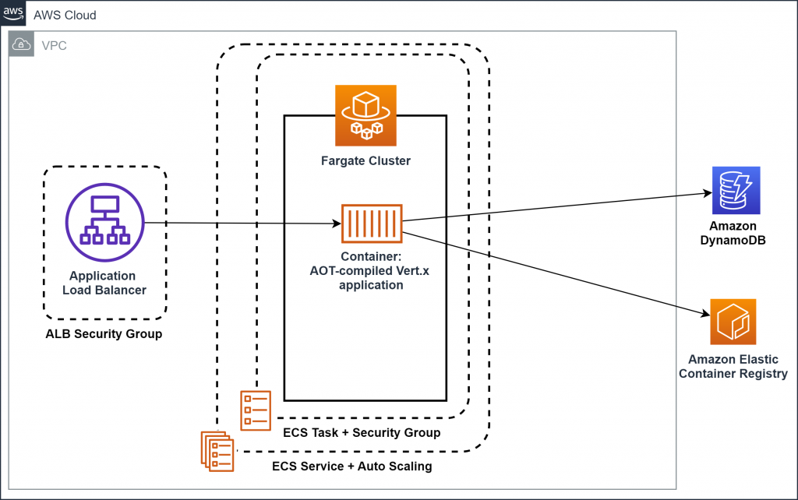
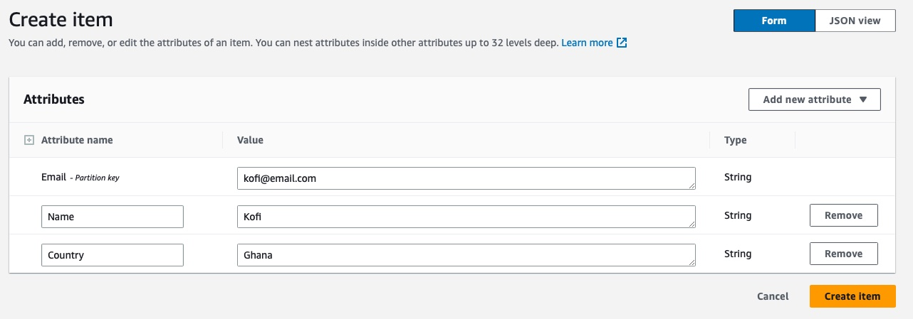

## About The Project

This project looks at creating a Guest Book web app with the PHP scripting language connected to an AWS Dynamo DB Table to populate the elements of the guests. The guest book would have Name, Email and Country fields

### Collaborations

This is a hand-on cloud engineering project delivered by the Azubi Africa Cloud Team(Team Agile) in 2023. After 6 months of AWS cloud training and front-end development, we got a chance to work on some realife cloud projects.
The team members below made this project successful :

1.  Joseph W Wafula [@their_linkedin]()
2.  Kevin Rwema [@kevin-rwema](https://www.linkedin.com/in/kevin-rwema/)
3.  Moses Boriowo [@moses-boriowo](https://www.linkedin.com/in/moses-boriowo/)
4.  Leonard Agyenim Boateng [@their_linkedin]()
5.  Mamadou Amadou Kebe [@mamadou-ammadou-kebe-994aa95a](https://www.linkedin.com/in/mamadou-ammadou-kebe-994aa95a/)
6.  Iraguha Benjamin[@their_linkedin]()
7.  Kennedy Manda [@their_linkedin]()
8.  Michael Theuri Munyori [@michael-munyori](https://www.linkedin.com/in/michael-munyori/)
9.  Tabitha Mutiso [@their_linkedin]()
10. Leslie Narh [@leslienarh](https://www.linkedin.com/in/leslienarh/)

## Technologies and tools used

- Git and GitHub
- PHP
- Brew(for MacOS users)
- HTML
- AWS SDK
- AWS Dynamo DB
- Terraform

## A simple PHP web app connected to AWS DynamoDB

<!-- setup a link to your images folder -->
<a href="[https://github.com/lawrencemuema/Cloud_project02](https://github.com/lawrencemuema/Cloud_project02/blob/main/images/fargate_arch.png)">
    
</a>

<p align="right">(<a href="#readme-top">back to top</a>)</p>

In this architecture diagram, a user sends a request to the PHP web server. The PHP app (front end) running on the web server receives the request, interacts with the DynamoDB API through the AWS SDK for PHP to retrieve or modify data stored in DynamoDB tables.

The PHP app (back end) processes the request, fetches or stores the data from the DynamoDB, and then sends the response back to the user through the web server.

The DynamoDB API, which is part of AWS's cloud services, allows the PHP app to read and write data from and to the DynamoDB tables, and the tables themselves store the data in a highly scalable and reliable manner.

## What we will accomplish

This tutorial will walk you through the steps to create the sample web application discussed above. You will:

- Manually create a Dynamo Table
- Install AWS SDK for PHP on local machine
- Update PHP script to interact with Dynamo DB Table Items
- Using terraform to create our dynamo dB table to reduce redundancy and complexities

<!-- GETTING STARTED -->

Getting Started

1. Follow the steps in this url to create a DynamoDB Table via the AWS console:
   <a href="https://www.youtube.com/watch?v=dOTUl2mZNVQ">Create Amazon Dynamo Table</a>

   Use below parameters:
   <ul>
   <li>Table Name: <i>GuestBook</i></li>
   <li>Partition key: <i>Email</i></li>
   <li>Data Type: <i>String</i></li>
   <li>Settings: <i>Customize settings</i></li>
   <li>Read/write capacity settings: <i>Provisioned<br>(mainatain default settings under read and write capacity)</br></i></li>
   </ul>

   After table is created, create items with necessary attributes. Below is an image of what we used:
   <br></br>
   
   <br></br>

2. Follow the steps in this url to install AWS SDK on your local machine
   <br>
   <a href="https://docs.aws.amazon.com/aws-sdk-php/v2/guide/installation.html">Install AWS SDK for PHP</a>
   </br>

3. Update the php block in guestlist.php with below script

```php
<?php
      // Include the AWS SDK for PHP library
      require 'vendor/autoload.php';
      use Aws\DynamoDb\DynamoDbClient;
      use Aws\DynamoDb\Exception\DynamoDbException;
      use Aws\Common\Aws;

      // Instantiate a new DynamoDB Client
      $client = DynamoDbClient::factory(
        array(
          'profile' => '<profile in your aws credentials file>',
          'region' => '<aws region name>',
          'version' => 'latest',
        )
      );

      // Define the table name
      $tableName = "GuestBook";

            $tableRows = '';

            // Try to retrieve table items to check if there's a connection
            try {
                $result = $client->scan([
                    'TableName' => $tableName
                ]);
                $items = $result['Items'];
            } catch (DynamoDbException $e) {
                // If there's an error, show an error message in a table row that spans 3 columns
                header('HTTP/1.1 500 Internal Server Error');
                $tableRows = '<tr><td colspan="3" style="color:red;text-align:center;">
                                Error connecting to DynamoDB:<br> ' . $e->getMessage() . '</td></tr>';
                echo $tableRows;
                exit();
            }

            // If there's no error, continue with your code here
            foreach ($items as $item) {
                $email = $item['Email']['S'];
                $country = $item['Country']['S'];
                $name = $item['Name']['S'];
                $tableRows .= '<tr>' .
                    '<td>' . $name . '</td>' .
                    '<td>' . $email . '</td>' .
                    '<td>' . $country . '</td>' .
                    '</tr>';
            }

            echo $tableRows;
?>
```
